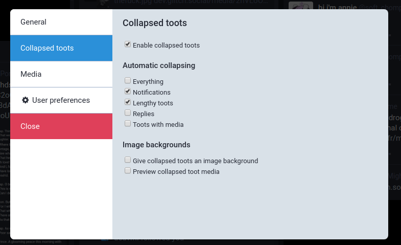

`glitch-soc` provides an App Settings modal to allow users to personalize the `glitch-soc` frontend.
This modal is accessible by clicking the "cogs" icon above the compose window, or from the Getting Started menu.

The settings made available by this modal are as follows:

###  General

#### Layout

| Name | Description |
| ---- | ----------- |
| Layout | Automatically find the most suitable layout, enforce Desktop mode or enforce Mobile mode. |
| Wide view | Stretches columns to better fill the available space. This setting only has an effect in Desktop mode. |
| Navbar at the bottom | In Mobile mode, move the navigation bar from the top of the screen to the bottom of the screen. |

#### Compose box options

| Name | Description |
| ---- | ----------- |
| Secondary toot button | Add a secondary toot button in order to quickly post toots using the specified alternate privacy setting. |
| When replying to a toot | Change the behavior of the secondary toot button when replying to a toot. It can be set to keep the privacy value set above, copy that of the toot being replied to, or select the strictest privacy setting between the default one and that of the toot being replied to. |

###  Collapsed toots

| Name | Description |
| ---- | ----------- |
| Enable collapsed toots | Enables [collapsible toot](../collapsible-toots/) functionality. |

####  Automatic collapsing

| Name | Description |
| ---- | ----------- |
| Everything | Every toot will be automatically collapsed when it first appears on the screen. |
| Notifications | Favourite and boost notifications (but not mentions) will be collapsed in the Notifications column. |
| Lengthy toots | Toots taller than 400px (or 650px with media) will be automatically collapsed. |
| Replies | Any toot which is replying to another toot, including self-replies, will be collapsed when it appears onscreen. |
| Boosts | Any boost will be automatically collapsed. |
| Toots with media | Toots containing media (images, videos) will be automatically collapsed. |

####  Image backgrounds

| Name | Description |
| ---- | ----------- |
| Give collapsed toots an image background | Toots which have been collapsed will be given a background reflecting the poster's header image. |
| Preview collapsed toot media | If a toot contains media (and that media is not hidden behind a CW or sensitive content marker), a preview of the media will be set as the toot's background. |

###  Media

| Name | Description |
| ---- | ----------- |
| Letterbox media | Wide images and videos will be displayed in full, with black bars at the top and bottom, as opposed to zoomed-in. |
| Full-width media | Images and videos will span the entire column width, as opposed to being confined to the text width. |
