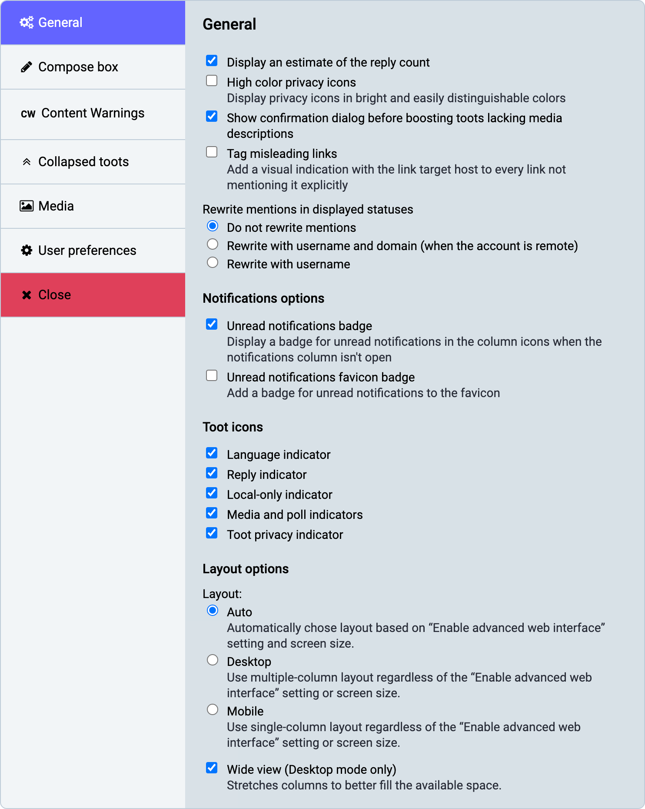
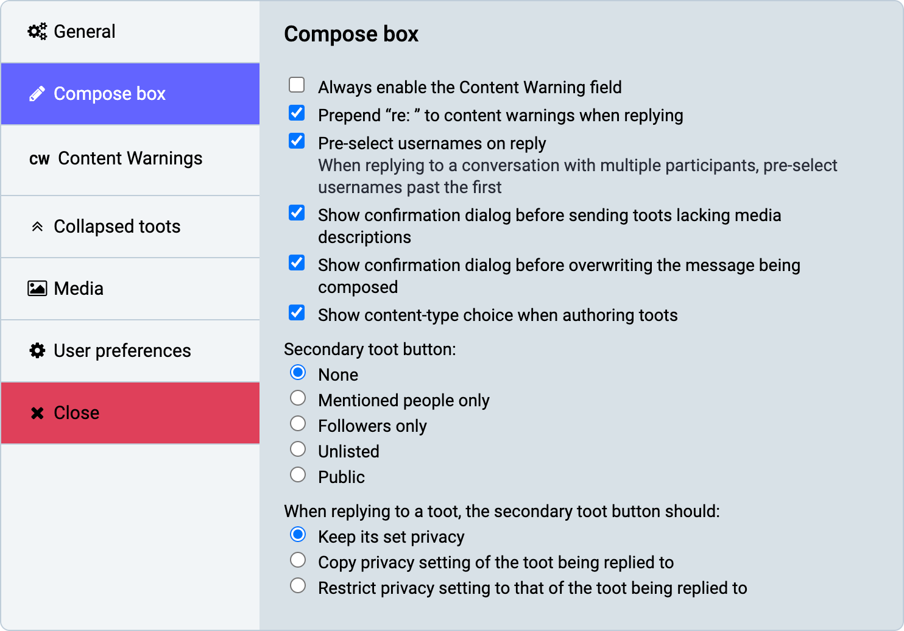
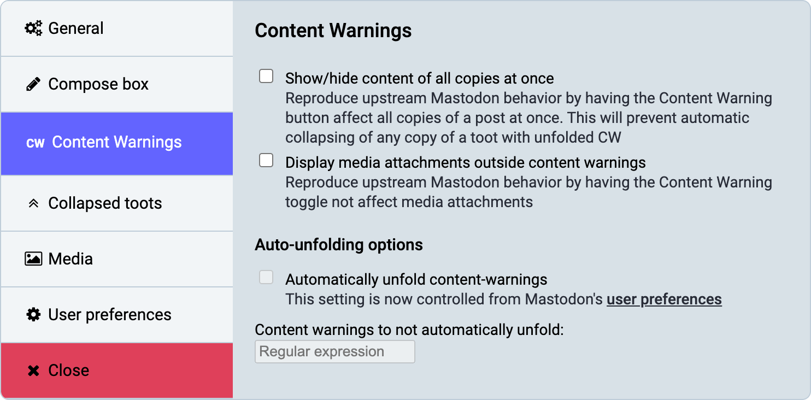
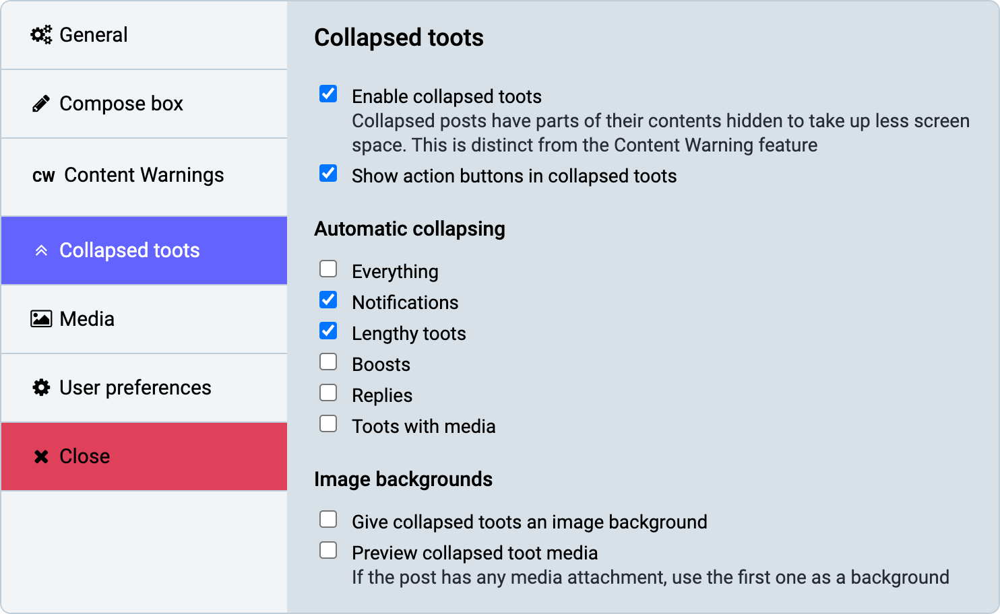
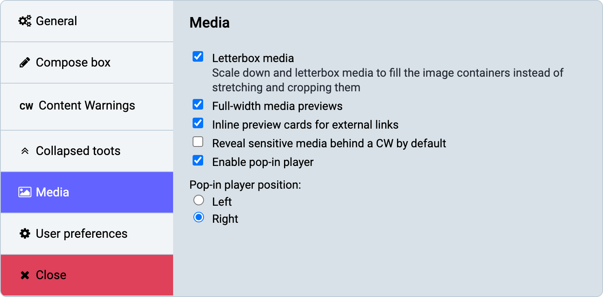

`glitch-soc` provides an App Settings modal to allow users to personalize the `glitch-soc` frontend.
This modal is accessible by clicking the "cogs" icon above the compose window, or from the Getting Started menu.

The settings made available by this modal are as follows:

###  General

| Name | Description |
| ---- | ----------- |
| Reply count | Display an estimate of the reply count |
| High color privacy icons | Display privacy icons in bright and easily distinguishable colors |
| Tag misleading links | Add a visual indication with the link target host to every link not mentioning it explicitly |

#### Rewrite mentions

Rewrite mentions in displayed statuses

| Name | 
| ------ |
| Do not rewrite mentions |
| Rewrite with username and domain (when the account is remote) |
| Rewrite with username |

#### Notifications options

| Name | Description |
| ---- | ----------- |
| Unread notifications badge | Display a badge for unread notifications in the column icons when the notifications column isn't open |
| Unread notifications favicon badge | Add a badge for unread notifications to the favicon |

#### Toot icons

| Name | 
| ------ |
| Language indicator |
| Reply indicator |
| Local-only indicator |
| Media and poll indicators |
| Toot privacy indicators |

#### Layout

| Name | Description |
| ---- | ----------- |
| Layout | Automatically find the most suitable layout, enforce Desktop mode or enforce Mobile mode. |
| Wide view | Stretches columns to better fill the available space. This setting only has an effect in Desktop mode. |

### Compose box

| Name | Description |
| ---- | ----------- |
| Content warning | Add ability to always show content warnings, prepend "re:" to content warnings when replying |
| Replies | Pre-select usernames when replying to multiple people |
| Confirmations | Show confirmation dialogs before sending toots lacking media descriptions or overwriting the message being composed |
| Content type | Show a content-type choice when authoring toots | 
| Secondary toot button | Add a secondary toot button in order to quickly post toots using the specified alternate privacy setting. |
| When replying to a toot | Change the behavior of the secondary toot button when replying to a toot. It can be set to keep the privacy value set above, copy that of the toot being replied to, or select the strictest privacy setting between the default one and that of the toot being replied to. |

### Content warnings

| Name | Description |
| ---- | ----------- |
| Show/hide content of all copies at once | Reproduce upstream Mastodon behavior by having the Content Warning button affect all copies of a post at once. This will prevent automatic collapsing of any copy of a toot with unfolded CW |
| Display media attachments outside content warnings | Reproduce upstream Mastodon behavior by having the Content Warning toggle not affect media attachments |
| Content warnings to not automatically unfold | Specify a regular expression for content warnings that should not be automatically unfolded |

###  Collapsed toots

| Name | Description |
| ---- | ----------- |
| Enable collapsed toots | Enables [collapsible toot](../collapsible-toots/) functionality. |
| Show action buttons in collapsed toots | |

####  Automatic collapsing

| Name | Description |
| ---- | ----------- |
| Everything | Every toot will be automatically collapsed when it first appears on the screen. |
| Notifications | Favourite and boost notifications (but not mentions) will be collapsed in the Notifications column. |
| Lengthy toots | Toots taller than 400px (or 650px with media) will be automatically collapsed. |
| Replies | Any toot which is replying to another toot, including self-replies, will be collapsed when it appears onscreen. |
| Boosts | Any boost will be automatically collapsed. |
| Toots with media | Toots containing media (images, videos) will be automatically collapsed. |

####  Image backgrounds

| Name | Description |
| ---- | ----------- |
| Give collapsed toots an image background | Toots which have been collapsed will be given a background reflecting the poster's header image. |
| Preview collapsed toot media | If a toot contains media (and that media is not hidden behind a CW or sensitive content marker), a preview of the media will be set as the toot's background. |

###  Media

| Name | Description |
| ---- | ----------- |
| Letterbox media | Wide images and videos will be displayed in full, with black bars at the top and bottom, as opposed to zoomed-in. |
| Full-width media | Images and videos will span the entire column width, as opposed to being confined to the text width. |
| Inline preview cards | Inline preview cards for external links |
| Reveal sensitive media | Reveal sensitive media behind a CW by default |
| Pop-in player | Enable a pop-in player and choose its position |