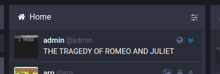
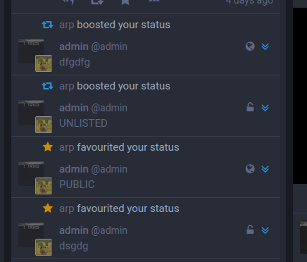

`glitch-soc` introduces a new feature to Mastodon known as "collapsible toots".
By clicking on the small double-angle icon in the top right of a toot, you can reduce the toot's size and hide away its contents.
This functionality can be configured, or disabled entirely, in [App Settings](../app-settings/).

This means you can finally put an end to madness like this:

By collapsing it to a single line:

In addition to regular toots, you can also auto-collapse your notifications to save space.

