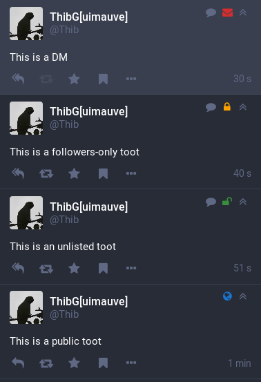

The visibility of a toot can be a bit hard to see at a glance on Mastodon, because the icon in the right of each toot has always the same grey color whatever the visibility.

By enabling it in the [app settings](../app-settings/), those visibility icons can be made more colorful, so that you can tell them apart much more easily.

