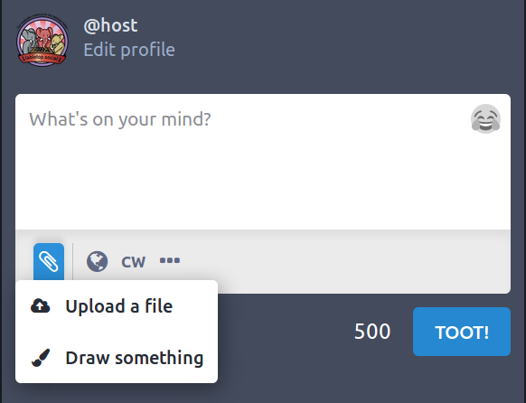
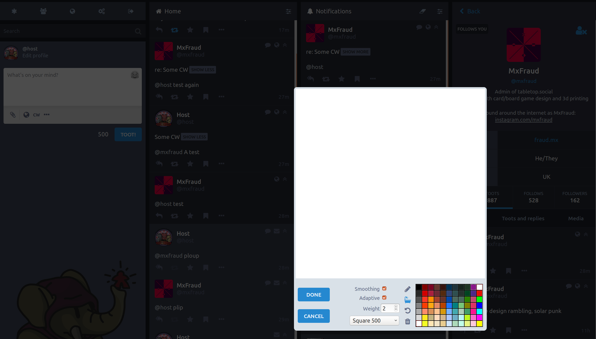
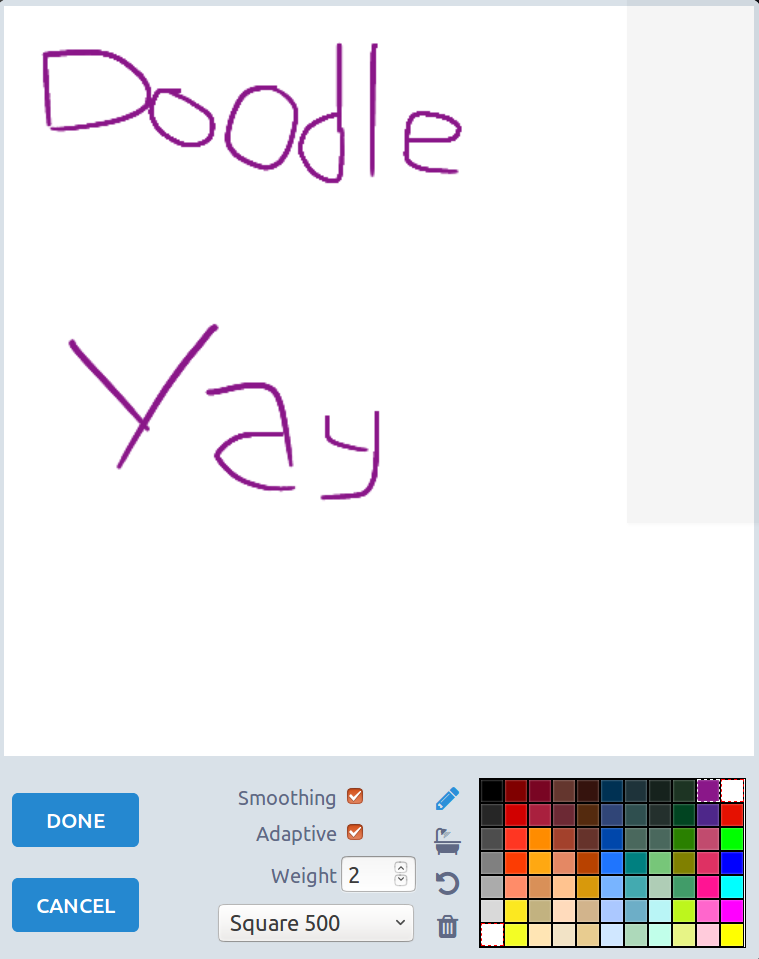
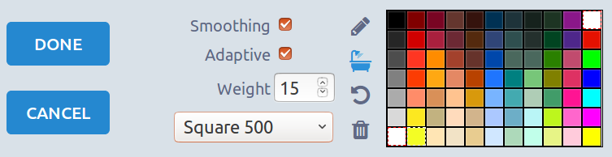

`glitch-soc` provides a way to draw picture and toot them

###  Doodles

Doodles are accessible via the file upload button.
  

Here is a screenshot of the doodle modal openned.
  

The interface allow you to do basic drawings:
  

The controls are as follow:

- Smoothing: the stroke will look less pixelated)
- Adapatative: 
- Weight: how large the stroke will be.
- Drop down: Choose the size of the image (square 500, tootbanner, 480p, SVGA, 16:9)
- Pencil: draw lines
- Shaower bath: draw the background
- Arrow: undo the last action
- Bin: clean the drawing
- Colour square: select a colour to draw with
 
