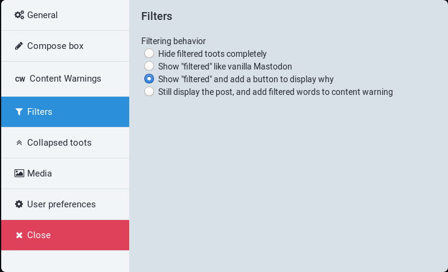
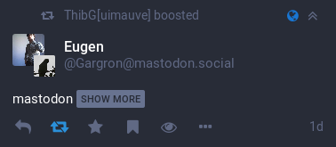

`glitch-soc`'s interface lets you handle filtered toots in a number of different ways,
configurable through the [app settings](../app-settings/).

Those options only apply to filters that are *not* marked as “Drop instead of hide”.

### Hide filtered toots completely

You can temporarily hide filtered toots completely instead of having having a
“Filtered” placeholder show up in your timelines.

### Show “filtered” like vanilla Mastodon

This shows a “Filtered” placeholder that cannot be acted upon in the timeline.

### Show “filtered” and add a button to display why

This shows a “Filtered” placeholder in the timeline, along with a clickable
button to show the reasons.

Clicking on that button brings up a modal allowing you to individually inspect
who the author of the toot is, and what filters matched the toot.

Finally, clicking the “Show” button of that popup lets you see the toot, with
an additional button to hide it again.

### Still display the post, and add filtered words to content warning

Still display the post in the timeline, but if any matching filter word was not
already present in a content warning, add it.

