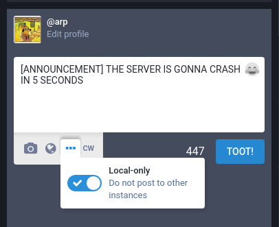
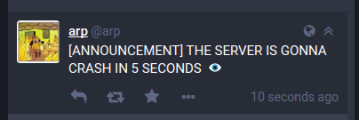

`glitch-soc` adds a feature called "local-only" or "non-federated" toots. Toots marked as such do not automatically federate to other instances, making them ideal for example for local server announcements and meta-discussion.

### Compose UI

A toot is marked as local-only using a dropdown in the compose UI:

Additionally, this can be done by appending the eye (:eye:) emoji at the very end of the toot.

In the timeline, it then looks like this:

