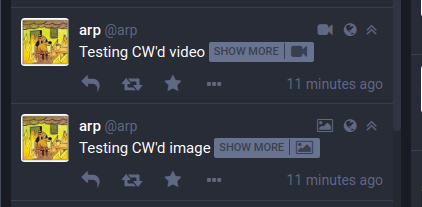
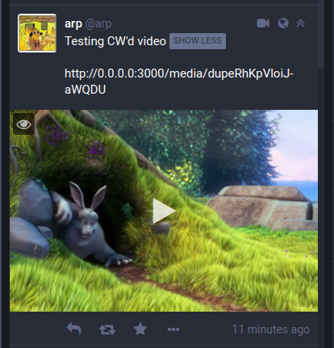
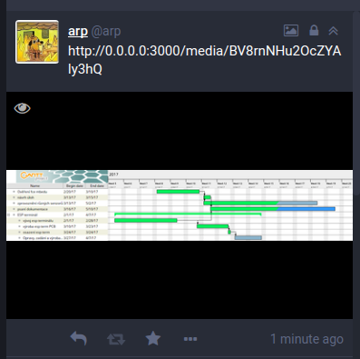
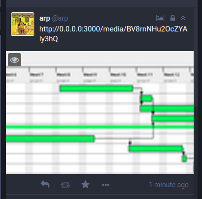

##  Media improvements  ##

`glitch-soc` has made a number of improvements to how media displays itself in the frontend.
These are outlined below.

###  Media is hidden by CWs

`glitch-soc` considers media to be a part of a toot's contents, so any media attachments are hidden behind CWs, just like any other aspect of the toot.
A media icon, representing the type of media which has been hidden, appears inside the SHOW MORE button to inform users as to the toot's contents.

###  Fullwidth images and videos

Images on `glitch-soc` stretch horizontally to fill the entire toot container, instead of being confined to the width of the text body.
This allows image previews to be rendered in greater clarity and provides an aesthetically pleasing experience.

This option is configurable in [App Settings](../app-settings/).

###  Media letterboxing (preview scaling mode)

Users can opt to view wide images in a letterbox format instead of stretching them to fill the image container. In letterbox mode, the image is scaled down to be fully visible in the available space.

This option is configurable in [App Settings](../app-settings/).

**Letterbox ON**

 

**Letterbox OFF**

