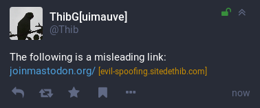

By default, `glitch-soc` will display the target domain of any link that does not
unambiguously start with it, in order to avoid misleading links such as spoofing
attempts.

This behavior can be disabled from the [app settings](../app-settings).
