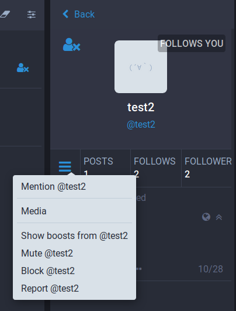

`glitch-soc` allows users to hide content boosted by accounts they follow.

When viewing a user's information page, clicking on the menu button brings up a list of actions, including "Hide boosts from @username":

When selecting this option, future boosts from that user will not appear in your feed. Old boosts from that user will remain in your feed, and boosts *of* that user's toots will also appear in your feed. Only new boosts *from* that user will be hidden.

To reverse this action, simply select the "Show boosts from @username" option:

### API

When using the API to interact with `glitch-soc`, you can use a `POST` to the `/api/v1/accounts/:id/follow` endpoint with a `reblogs` parameter (either set in the query-string, or via a JSON post similar to `{"reblogs":false}`) to disable or enable showing boosts. Setting the `reblogs` parameter to `false` will hide boosts from a user, and setting it to `true` (the default) will show boosts from a user.

This endpoint is idempotent, and can be `POST`ed to even if the account is already being followed. The endpoint can of course be used when initiating a follow: even if the follow is a remote follow or must be approved by the other user, the `reblogs` setting will be kept when the follow succeeds.
