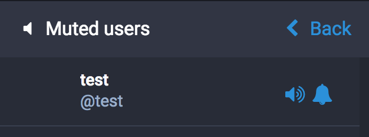

`glitch-soc` allows users to decide when muting another user whether they wish to continue to receive notifications from the muted user. This allows users to choose between `tootsuite`'s current muting behavior and its behavior prior to v1.5.0.

When muting a user, the confirmation dialog includes a checkbox asking "Hide notifications from this user?", pictured below:

With "Hide notifications from this user?" checked, mutes behave like they do on ordinary Mastodon or on Twitter: you no longer see toots from the user in timelines or in the context for other toots, and you no longer receive notifications from the user. With it unchecked, mutes behave the same except you continue to receive notifications from the muted user.

In the list of muted users, in users' following/followers lists, and similar lists of users, muted users have a bell-shaped button to toggle whether the mute hides notifications. When the mute currently does not hide notifications, the button hides notifications from the user and looks like:

and when the mute is set to hide notifications, the button disables notification hiding and looks like:

