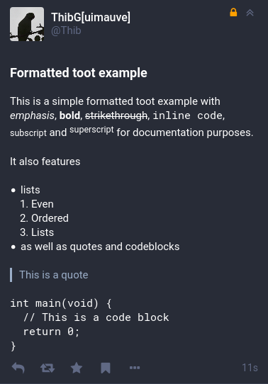
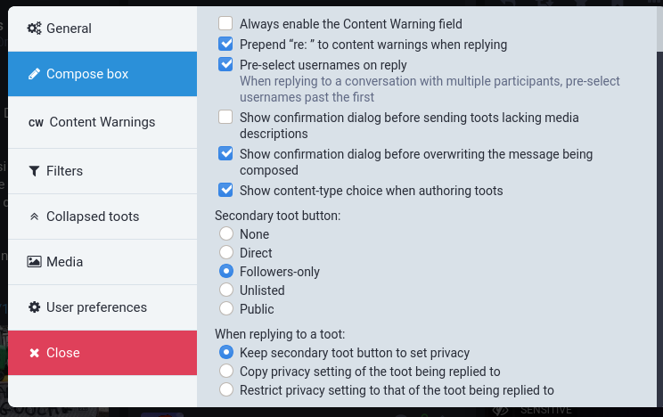
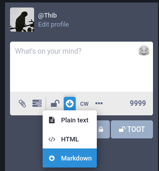
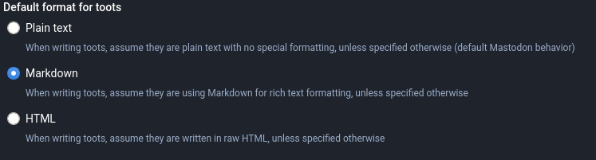

Unlike `Mastodon`, `glitch-soc` supports some formatting in toots.

Formatted toots are displayed as such in the `glitch` flavor but can be degraded
in the `vanilla` flavor and some mobile apps.

Please be aware that most of the toot formatting will be stripped by mainline `Mastodon`,
which may lead to the meaning of your toots being altered.

### Allowed formatting

Allowed formatting is in glitch-soc toots include: headers, bold, italics, strikethrough,
blockquotes, inline code, code blocks, subscript, superscript and lists.

### Authoring formatted toots

Toots can be written in three source formats:
- Plain text: toots are treated like in vanilla Mastodon, and are not formatted
- Markdown: toots can be written in [Markdown](markdown), as understood by [Redcarpet](redcarpet)
- HTML: toots are written directly in HTML (but sanitized to strip any unsupported formatting)

You can write toots in Markdown or HTML from the `glitch` flavour by first enabling “Show content-type choice when authoring toots”
in the “Compose box” tab of the [app settings](../app-settings/).

Then, for each toot, you can select whether you want to want to author them in Plain text, Markdown or HTML by using the *content-type drop-down*:

In addition to that, you can set your *default content-type* from the user settings.
Toots posted from applications which do not support glitch-soc's toot formatting will be understood as written in that selected content-type.

[markdown]: https://en.wikipedia.org/wiki/Markdown
[redcarpet]: https://github.com/vmg/redcarpet
