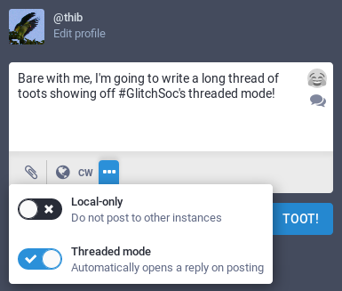
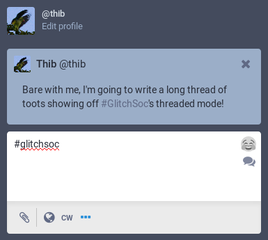

`glitch-soc` adds a "threaded mode" feature to the toot compose interface.
This eases writing "threads" of several toots.

### Compose UI

Threaded mode is enabled by using the dropdown in the compose UI:

A reply is prepared as soon as the toot is sent, pre-filled with any used hashtag:

Discarding the reply will exit threaded mode.
