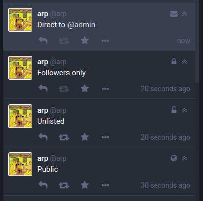

##  Toot visibility icons  ##

With the regular Mastodon front-end, you can't really tell when a toot is unlisted, and other visibility options are indicated by changing the boost icon.

`glitch-soc` improves this so the visibility is always clear: The boost icon never changes, but goes dim when the button is disabled. Instead, a new icon was added to the right top of each toot, identical to the icon in the visibility picker you used to compose the toot.

This way, you always know what visibility a toot has.

