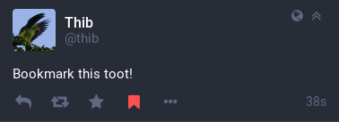
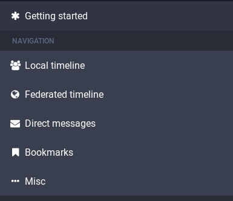
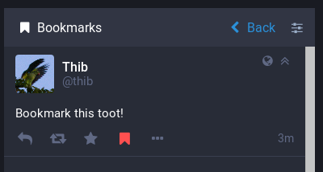

`glitch-soc` allows users to bookmark toots for accessing them later.

Like favourites, the list of bookmarked toots is stored server-side so that it
can be accessed from different devices. Unlike favourites, though, that
information is not shared with any other user, not even the author of the
bookmarked toot.

The bookmark button is located in the toot's action bar and changes colors when the toot is bookmarked:

Bookmarked toots can then be accessed from the "Getting started menu":

### API

When using the API to interact with `glitch-soc`, you can use a `POST` to the `/api/v1/statuses/:id/bookmark` endpoint to bookmark a toot and `/api/v1/statuses/:id/unbookmark` to remove a bookmark.

You can also `GET` `/api/v1/bookmarks` to get the list of toots bookmarked by the logged-in user.
