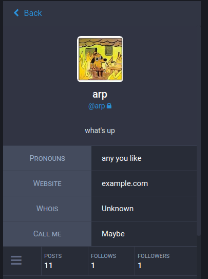
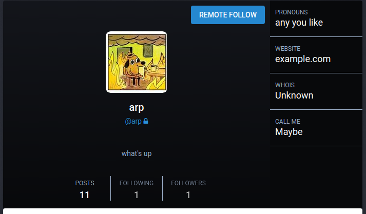

Both `Mastodon` and `glitch-soc` allow users to input optional `key: value` pairs in their bios, rendered in a table by the frontend and on static pages.

This is what it looks like for logged-in users on a glitch-soc server:



And for everyone else, it shows to the right of the avatar:



This is done from the profile edition page in glitch-soc's settings.

## Legacy glitch-soc implementation

Before being adopted upstream, `glitch-soc` users used optional `key: value` pairs as YAML-esque frontmatter at the beginning of their bios.

An example of a bio with this frontmatter is as follows:

```yaml
---
Pronouns: any you like
Website: example.com
Whois: Unknown
Call me: Maybe
...

what's up
```

###  Syntax

> *In brief:* start with `---`, then add `key: value` one per line,
> and close it with `...` on it's own line. Anything that follows
> is your bio text.

The syntax for profile frontmatter matches that used for single-line YAML implicit keys.
Strings may be provided in single-quoted, double-quoted or plain (unquoted) styles.

Although `glitch-soc` borrows the *syntax* of YAML for its profile frontmatter, it does not borrow the *semantics*: Ordering and duplicate keys are preserved, and every value is interpreted as a string.
Links, hashtags, and mentions are all valid inside of frontmatter keys or values.
